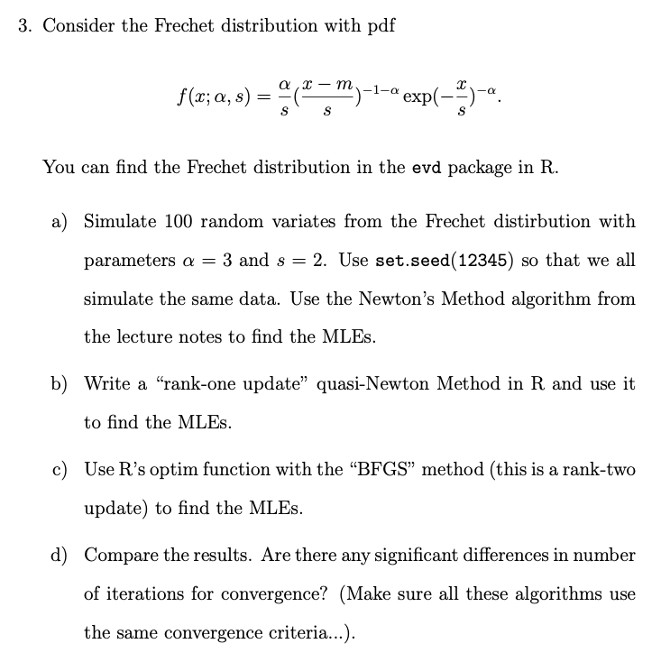

```{r setup, include=FALSE}
knitr::opts_chunk$set(echo = TRUE)
messages = FALSE
```

## Topics
Poisson regression model, Newton’s Method update for the MLE estimator, Newton’s Method with the log link, Weibull distribution, MLEs using the fixed point iteration, Frechet distirbution, “rank-one update” quasi-Newton Method, “BFGS” method

## Problems 1:


### 1.1


```{r}
library(glm2)
data(crabs)

crabs$Dark <- ifelse(crabs$Dark == "no",0,1)
crabs$GoodSpine <- ifelse(crabs$GoodSpine == "no",0,1)

poisson_loglikelihood <- function(theta, data){
  
  y <- data[1]
  x1 <- data[2]
  x2 <- data[3]
  x3 <- data[4]
  theta_1 <- theta[1]
  theta_2 <- theta[2]
  theta_3 <- theta[3]
  
  return( 
    sum(y*(x1*theta_1+x2*theta_2+x3*theta_3)-exp(x1*theta_1+x2*theta_2+x3*theta_3)-log(factorial(y)))
  )
}

gradient_poisson_loglikelihood <- function(theta, data){
  
  y <- data[1]
  x1 <- data[2]
  x2 <- data[3]
  x3 <- data[4]
  theta_1 <- theta[1]
  theta_2 <- theta[2]
  theta_3 <- theta[3]
  
  return( 
    
    matrix( 
      c(
        sum((y*x1)-(x1*exp(x1*theta_1+x2*theta_2+x3*theta_3))),
        sum((y*x2)-(x2*exp(x1*theta_1+x2*theta_2+x3*theta_3))),
        sum((y*x3)-(x3*exp(x1*theta_1+x2*theta_2+x3*theta_3)))
      )
      , 3,1))
}

hessian_poisson_loglikelihood <- function(theta, data){
  
  y <- data[1]
  x1 <- data[2]
  x2 <- data[3]
  x3 <- data[4]
  theta_1 <- theta[1]
  theta_2 <- theta[2]
  theta_3 <- theta[3]
  
  return( 
    
    matrix( c(  
      
      sum(-((x1^2)*exp(x1*theta_1+x2*theta_2+x3*theta_3))),
      sum(-((x1^x2)*exp(x1*theta_1+x2*theta_2+x3*theta_3))),
      sum(-((x1^x3)*exp(x1*theta_1+x2*theta_2+x3*theta_3))),
      sum(-((x2*x1)*exp(x1*theta_1+x2*theta_2+x3*theta_3))),
      sum(-((x2^2)*exp(x1*theta_1+x2*theta_2+x3*theta_3))),
      sum(-((x2*x3)*exp(x1*theta_1+x2*theta_2+x3*theta_3))),
      sum(-((x3*x1)*exp(x1*theta_1+x2*theta_2+x3*theta_3))),
      sum(-((x3*x2)*exp(x1*theta_1+x2*theta_2+x3*theta_3))),
      sum(-((x3^2)*exp(x1*theta_1+x2*theta_2+x3*theta_3)))
      
      
    ) , 3, 3 )
    
  )
}

inv_grad_loglikelihood <- function(theta, data) {
  
  return(
    solve(hessian_poisson_loglikelihood(theta, data))
  )
}

newtons_method <- function(init_par, fun, grad, inv_hess, tol, max_iter, data){
  
  rel_tol <- 2*tol
  par_old <- init_par
  iter_count <- 0
  iter_par <- matrix(0,max_iter+1,length(init_par))
  iter_par[1,] <- t(init_par)   
  
  while(rel_tol > tol & iter_count < max_iter){
    
    par_new <- par_old - inv_hess(par_old, data)%*%grad(par_old, data)
    rel_tol <- max(abs(par_new - par_old)/par_old)
    par_old <- par_new
    iter_count <- iter_count + 1
    iter_par[iter_count+1,] <- t(par_new)
    
  }
  
  return(list(solution = par_new, fun_solution = fun(t(par_new), data), 
              final_tol = rel_tol, num_iters = iter_count, all_iters = iter_par[1:iter_count,]))
  
}


NM_poisson <- newtons_method(c(0.1,0.1,0.1), poisson_loglikelihood, 
                             gradient_poisson_loglikelihood, inv_grad_loglikelihood, 0.001, 10, crabs)

NM_poisson

#calculate without intercept
glm(Satellites~Width+Dark+GoodSpine-1, family=poisson(link="log"), data = crabs) #for comparison
```


## Problems 2:


### 2.1


```{r}
library(evd)
set.seed(12345)
wb <- rweibull(50, shape=5, scale = 7)

beta_theta_mle <- function(beta_theta, x){
  
  n <- length(x)
  
  return(
    c(((sum((x^beta_theta[1])*log(x))/sum((x^beta_theta[1]))) - (1/n)*sum(log(x)))^-1,((1/n)*sum((x^beta_theta[2])))^(1/beta_theta[2]))
    
  )
}

b_t_last <- c(.1,.1)
b_t_next <- c(1,1)

while(abs(b_t_next[1] - b_t_last[1])>0.01 | abs(b_t_next[2] - b_t_last[2])>0.01){
  b_t_last[1] <- b_t_next[1]
  b_t_last[2] <- b_t_next[2]
  b_t_next <- beta_theta_mle(b_t_last,wb)
  
}
print("estimated beta and theta are:")
print(b_t_next)

```

## Problems 3:


### a). Use the Newton's Method algorithm (Secant Method as required by professor) from the lecture notes to find the MLEs.

```{r}
library(evd)
set.seed(12345)
x = rfrechet(100, shape=3, scale=2)

frechet_loglikelihood <- function(k_theta, data){
  
  a <- k_theta[1]
  s <- k_theta[2]
  n <- length(data)
  
  return( 
    n*log(a)-n*log(s)-(1+a)*sum(log(data))+(n*(1+a)*log(s))-sum((s/data)^a)
  )
}

secant_method <- function(init_par, fun, tol, max_iter, data){
  
  eps <- 0.01
  rel_tol <- 2*tol
  par_old <- init_par
  iter_count <- 0
  iter_par <- matrix(0,max_iter+1,length(init_par))
  iter_par[1,] <- t(init_par)
  dim_par <- length(init_par)

  approx_grad <- rep(0, dim_par)
  approx_hess <- matrix(0, dim_par, dim_par)

  
  while(rel_tol > tol & iter_count < max_iter){
    
    for(i in 1:dim_par){
      del <- rep(0,dim_par)
      del[i] <- eps
      approx_grad[i] <- (0.5/eps)*(fun(t(par_old+matrix(del,dim_par,1)),data) - fun(t(par_old), data))
    }

    for(i in 1:dim_par){
      del1 <- rep(0,dim_par)
      del1[i] <- eps
      for(j in 1:dim_par){
        del2 <- rep(0,dim_par)
        del2[j] <- eps

        if(i == j){

          approx_hess[i,j] <- (1/(eps^2))*(fun(t(par_old
                                                 +matrix(del1,dim_par,1)),data)
                                           -2*fun(t(par_old),data) 
                                           +fun(t(par_old-matrix(del1,dim_par,1)),data))    
        }else {
          approx_hess[i,j] <- (0.25/(eps^2))*(fun(t(par_old+matrix(del1,dim_par,1)
                                                    +matrix(del2,dim_par,1)),data)
                                              -fun(t(par_old+matrix(del1,dim_par,1)
                                                     -matrix(del2,dim_par,1)),data)
                                              -fun(t(par_old-matrix(del1,dim_par,1)
                                                     +matrix(del2,dim_par,1)),data)
                                              +fun(t(par_old-matrix(del1,dim_par,1)
                                                     -matrix(del2,dim_par,1)),data))
        }
      }
    }
    
    
    par_new <- par_old - solve(approx_hess)%*%approx_grad 
    rel_tol <- max(abs(par_new - par_old)/par_old)
    par_old <- par_new
    iter_count <- iter_count + 1
    iter_par[iter_count+1,] <- t(par_new)
    
  }
  
  return(list(solution = par_new, fun_solution = fun(t(par_new), data), 
              final_tol = rel_tol, num_iters = iter_count, all_iters = iter_par[1:iter_count,]))
}


se_frechet <- secant_method(matrix(c(1,1),2,1), frechet_loglikelihood, 0.0000001, 5000, x)
se_frechet

```


## Problems 3:

### b). Write a "rank-one update" quasi-Newton Method in R and use it to find the MLEs.

```{r}
library(evd)
set.seed(12345)
r_frechet = rfrechet(100, shape=3, scale=2)
frechet_loglikelihood <- function(k_theta,x){
  
  a <- k_theta[1]
  s <- k_theta[2]
  n <- 100
  
  return( 
    n*log(a)-n*log(s)-(1+a)*sum(log(x))+(n*(1+a)*log(s))-sum((s/x)^a)
  )
}


gradient_frechet_loglikelihood <- function(k_theta,x){
  
  a <- k_theta[1]
  s <- k_theta[2]
  n <- 100
  
  return( 
    matrix(
      
      c( (n/a)-sum(log(x))+(n*log(s))-sum(((s/x)^a)*log(s/x)), 
         
         (-n/s)+(n*(1+a)/s)-(a/s)*sum((s/x)^a)
         
      ),2,1))
}


rank1_newtons_method <- function(init_par, fun, grad, tol, max_iter, data){
  
  rel_tol <- 2*tol
  par_old <- init_par
  iter_count <- 0
  iter_par <- matrix(0,max_iter+1,length(init_par))
  iter_par[1,] <- t(init_par)
  mu = 0.01
  H <- diag(2)
  
  while(rel_tol > tol & iter_count < max_iter){
    
    par_new <- par_old - mu*H%*%grad(par_old, data)
    
    if (fun(par_new,data) <= fun(par_old,data)){
      
      mu <- mu/2
    }
    
    z <- par_new-par_old
    y <- grad(par_new, data) - grad(par_old, data)
    add_term <- ((z-H%*%y)%*%(t(z-H%*%y)))/as.vector((t(z-H%*%y))%*%y)
    H <- H + add_term
    
    rel_tol <- max(abs(par_new - par_old)/par_old)
    par_old <- par_new
    iter_count <- iter_count + 1
    iter_par[iter_count+1,] <- t(par_new)
    
  }
  
  return(list(solution = par_new, fun_solution = fun(t(par_new), data),
              final_tol = rel_tol, num_iters = iter_count))
  
} #removed all_iters

rank1_NM_rfrechet <- rank1_newtons_method(c(1,1), frechet_loglikelihood, 
                                          gradient_frechet_loglikelihood, 0.0000001, 5000, r_frechet)

rank1_NM_rfrechet


```


## Problems 3:

### c). Use R's optim function with the "BFGS" method (this is a rank-two update) to find the MLEs.
```{r}
library(evd)
set.seed(12345)
x = rfrechet(100, shape=3, scale=2)
frechet_loglikelihood <- function(k_theta){
  
  a <- k_theta[1]
  s <- k_theta[2]
  n <- 100
  
  return( 
    -(n*log(a)-n*log(s)-(1+a)*sum(log(x))+(n*(1+a)*log(s))-sum((s/x)^a))
  )
}


gradient_frechet_loglikelihood <- function(k_theta){
  
  a <- k_theta[1]
  s <- k_theta[2]
  n <- 100
  
  return( 
    
    c( -((n/a)-sum(log(x))+(n*log(s))-sum(((s/x)^a)*log(s/x))), 
                
       -((-n/s)+(n*(1+a)/s)-(a/s)*sum((s/x)^a))
    
  ))
}

rank2 <- optim(c(1, 1), fn=frechet_loglikelihood, gr = gradient_frechet_loglikelihood, 
             method = "BFGS",control=list(trace = 1, reltol = 0.0000001))

rank2


```


## Problems 3:

### d). Compare the results. Are there any significant differences in number of iterations for convergence?

Under the same tolerance level at 0.0000001, both the Secant Method and Rank-two Update Quasi-Newton Method appear to have the small number of iterations (24 and 11) to achieve convergence. However, it takes around 4600 iterations for our version of Rank-one Update Quasi-Newton Method to make convergence. I think the reason why this happens is that in order to avoid overshooting and exploding gradients problems, we need a very small step size mu at 0.01 and it will be updated to be the half of itself for some iteration which new parameters does not increase the likelihood of estimator, so that the mu will become even smaller and it will need more iterations to make convergence.


