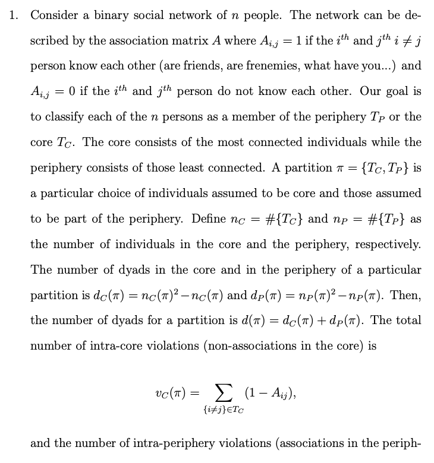
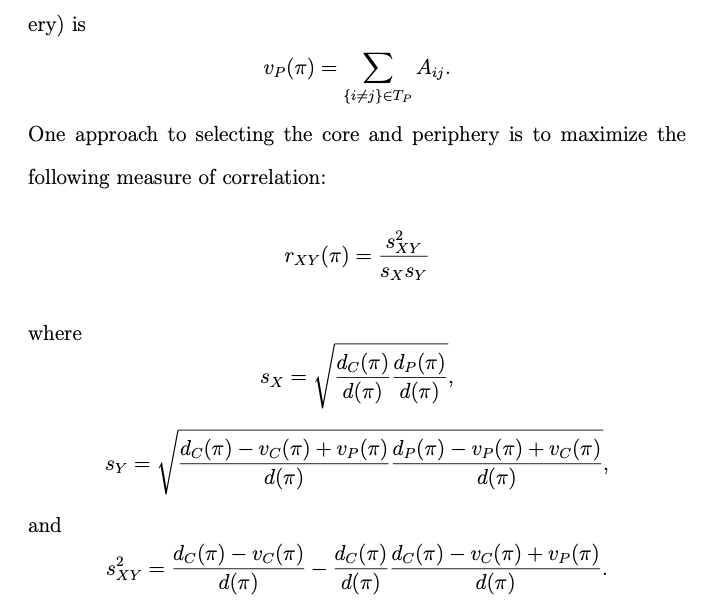
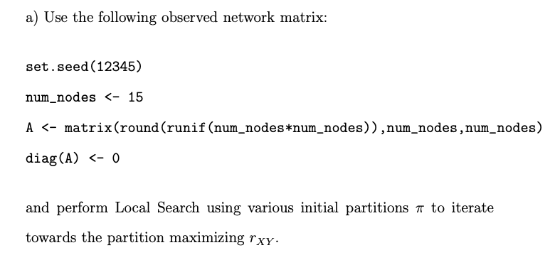
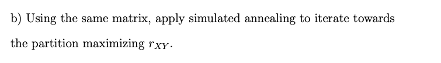
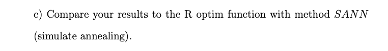
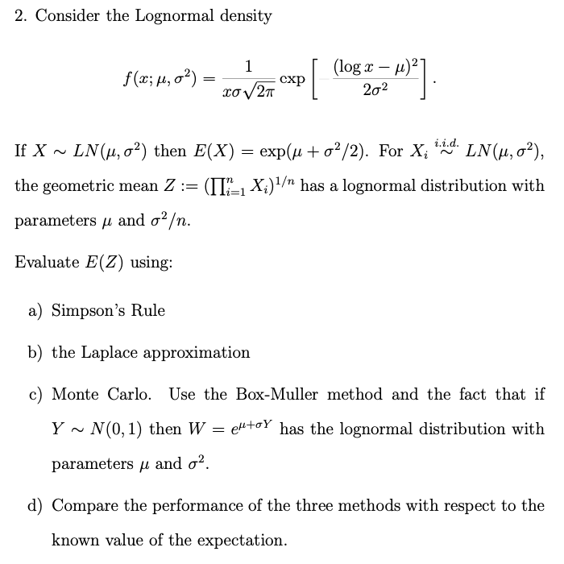

Topics:
-------
Binary-Social-Network-Classification, Local Search and Simulated Annealing, Lognormal density, Simpson’s Rule, Laplace approximation, Monte Carlo, Box-Muller method

Problems 1 Binary-Social-Network-Classification:
------------------------------------------------

### Using Local Search and Simulated Annealing

### Implementation in R

-   The goal is to classify each of the n persons in the network
    described by an association matrix to a member of periphery TP or
    core TC

-   Defined the approach by maximizing the measure of correlation rXY
    consists of number of dyads for a partition with intra-core and
    intra-periphery violations to classify the core and periphery

-   Performed Local Search and Simulated Annealing using various initial
    partitions π to iterate towards the partition maximizing rXY

a.): Use the observed network matrix and perform Local Search using
various initial partitions π to iterate towards the partition maximizing
rXY.

b.): Using the same matrix, apply simulated annealing to iterate towards
the partition maximizing rXY.

c.): Use the observed network matrix and perform Local Search using
various initial partitions π to iterate towards the partition maximizing
rXY.

 

### a). Local Search (Steepest Descent)

    #########################################################################
    rxy <- function(p_vec, A){
      p <- length(p_vec)
      nc <- sum(p_vec == 0)
      np <- sum(p_vec == 1)
      dc <- nc^2 - nc
      dp <- np^2 - np
      dpi <- dc+dp
      class_c <- which(p_vec == 0)
      class_p <- which(p_vec == 1)
      
      if (!identical(class_c, integer(0))){
        A_c <- c()
        for (i_c in class_c){
          for (j_c in class_c){
            if (i_c!=j_c){
              A_c <- c(A_c,A[i_c,j_c])
            }
          }
        }
      }else{A_c <- NULL}
      
      if (!identical(class_p, integer(0))){
        A_p <- c()
        for (i_p in class_p){
          for (j_p in class_p){
            if (i_p!=j_p){
              A_p <- c(A_p,A[i_p,j_p])
            }
          }
        }
      }else{A_p <- NULL}
      
      vc <- length(A_c)-sum(A_c)
      vp <- length(A_p)-sum(A_p)
      Sx <- sqrt((dc/dpi)*(dp/dpi))
      Sy <- sqrt(((dc-vc+vp)/dpi)*((dp-vp+vc)/dpi))
      Sxy2 <- (dc-vc)/dpi-(dc/dpi)*((dc-vc+vp)/dpi)
      r_xy <- Sxy2/(Sx*Sy)
      return(r_xy)
    }
    #########################################################################
    steepest.ascent.step <- function(old_p_vec, A){

      p <- length(old_p_vec)
      f_p_vec <- rxy(old_p_vec, A)
      f_p_vec_nbhd <- rep(0,p)
      for(i in 1:p){
        new_p_vec <- old_p_vec
        new_p_vec[i] <-1 - old_p_vec[i]

          f_p_vec_nbhd[i] <- rxy(new_p_vec, A)

      }
      steepest <- which.max(f_p_vec_nbhd)
      if(f_p_vec_nbhd[steepest]>f_p_vec){
        new_p_vec <- old_p_vec
        new_p_vec[steepest] <-1 - old_p_vec[steepest]
        return(list(next.iter = new_p_vec, rxy = f_p_vec_nbhd[steepest], rxy.old = f_p_vec))
      }else{
        return(list(next.iter = old_p_vec, rxy = f_p_vec))
      }
    }
    #########################################################################
    iter.steepest.ascent <- function(init_point, max_iter, tol, A){
      if (all(init_point==0) | all(init_point==1)){
        return("Initial Partition cannot be all-zeros or all-ones")
      }else{
      
      n_diff <- 2*tol
      num_iter <- 0
      x_old <- init_point
      while(n_diff > tol & num_iter < max_iter){
        next_iteration <- steepest.ascent.step(x_old, A)
        x_new <- next_iteration$next.iter
        if(all(x_new == x_old)){
          num_iter <- num_iter+1
          return(list(message = "No neighborhood points increased rxy ", soln = next_iteration$next.iter, rxy = next_iteration$rxy, num.iters=num_iter))
        }else{
          num_iter <- num_iter+1
          n_diff <- abs(next_iteration$rxy-next_iteration$rxy.old)
          x_old <- x_new
        }
      }
      return(list(soln = x_new, final.tol = n_diff, num.iters = num_iter))
      }
    }

    num_nodes <- 15
    set.seed(12345)
    A <- matrix(round(runif(num_nodes*num_nodes)),num_nodes,num_nodes)
    diag(A) <- 0
    A[lower.tri(A)] <- t(A)[lower.tri(t(A))]
    p_vec_1 <- c(rep(1,7),rep(0,8))
    p_vec_2 <- c(rep(1,5),rep(0,5), rep(1,5))
    p_vec_3 <- c(rep(1,5),rep(0,5),rep(1,3),rep(0,2))

    iter.steepest.ascent(p_vec_1, 1000, .001, A)

    ## $message
    ## [1] "No neighborhood points increased rxy "
    ## 
    ## $soln
    ##  [1] 1 0 0 1 1 0 1 0 1 1 0 0 0 0 0
    ## 
    ## $rxy
    ## [1] 0.4361494
    ## 
    ## $num.iters
    ## [1] 6

    iter.steepest.ascent(p_vec_2, 1000, .001, A)

    ## $message
    ## [1] "No neighborhood points increased rxy "
    ## 
    ## $soln
    ##  [1] 0 1 1 1 1 0 0 1 0 0 0 1 1 0 1
    ## 
    ## $rxy
    ## [1] 0.4564355
    ## 
    ## $num.iters
    ## [1] 5

    iter.steepest.ascent(p_vec_3, 1000, .001, A)

    ## $message
    ## [1] "No neighborhood points increased rxy "
    ## 
    ## $soln
    ##  [1] 0 1 1 1 1 0 0 1 0 0 0 1 1 0 1
    ## 
    ## $rxy
    ## [1] 0.4564355
    ## 
    ## $num.iters
    ## [1] 5

### b). Simulated Annealing

    #########################################################################
    rxy <- function(p_vec, A){
      p <- length(p_vec)
      nc <- sum(p_vec == 0)
      np <- sum(p_vec == 1)
      dc <- nc^2 - nc
      dp <- np^2 - np
      dpi <- dc+dp
      class_c <- which(p_vec == 0)
      class_p <- which(p_vec == 1)
      
      if (!identical(class_c, integer(0))){
        A_c <- c()
        for (i_c in class_c){
          for (j_c in class_c){
            if (i_c!=j_c){
              A_c <- c(A_c,A[i_c,j_c])
            }
          }
        }
      }else{A_c <- NULL}
      
      if (!identical(class_p, integer(0))){
        A_p <- c()
        for (i_p in class_p){
          for (j_p in class_p){
            if (i_p!=j_p){
              A_p <- c(A_p,A[i_p,j_p])
            }
          }
        }
      }else{A_p <- NULL}
      
      vc <- length(A_c)-sum(A_c)
      vp <- length(A_p)-sum(A_p)
      Sx <- sqrt((dc/dpi)*(dp/dpi))
      Sy <- sqrt(((dc-vc+vp)/dpi)*((dp-vp+vc)/dpi))
      Sxy2 <- (dc-vc)/dpi-(dc/dpi)*((dc-vc+vp)/dpi)
      r_xy <- Sxy2/(Sx*Sy)
      return(r_xy)
    }
    #########################################################################
    simulated.annealing.step <- function(old_p_vec, temp, A){
      p <- length(old_p_vec)
      f_p_vec <- rxy(old_p_vec, A)
      f_p_vec_nbhd <- rep(0,p)
      for(i in 1:p){
        new_p_vec <- old_p_vec
        new_p_vec[i] <-1 - old_p_vec[i]
        
        f_p_vec_nbhd[i] <- rxy(new_p_vec, A)
        
      }
      rand.choice <- sample.int(p,1)
      # print(rand.choice)
      if(f_p_vec_nbhd[rand.choice]>f_p_vec){
        new_p_vec <- old_p_vec
        new_p_vec[rand.choice] <-1 - old_p_vec[rand.choice]
        return(list(next.iter = new_p_vec, rxy = f_p_vec_nbhd[rand.choice]))
      }else {
        p_a <- min(1, exp((f_p_vec-f_p_vec_nbhd[rand.choice])/temp))
        if(rbinom(1,1,p_a)==1){
          return(list(next.iter = new_p_vec, rxy = f_p_vec_nbhd[rand.choice]))
        }else{
          return(list(next.iter = old_p_vec, rxy = f_p_vec))
        }
      }
    }
    #########################################################################
    iter.sim.annealing <- function(init_point, max_iter, temps, A){
      if (all(init_point==0) | all(init_point==1)){
        return("Initial Partition cannot be all-zeros or all-ones")
      }else{
      num_iter <- 0
      x_old <- init_point
      while(num_iter < max_iter){
        next_iteration <- simulated.annealing.step(x_old, temps[num_iter+1], A)
        x_new <- next_iteration$next.iter
        num_iter <- num_iter+1
        x_old <- x_new
        }
      return(list(soln = x_new, f_soln = next_iteration$rxy))
      }
    }

    num_nodes <- 15
    set.seed(12345)
    A <- matrix(round(runif(num_nodes*num_nodes)),num_nodes,num_nodes)
    diag(A) <- 0
    A[lower.tri(A)] <- t(A)[lower.tri(t(A))]
    p_vec_1 <- c(rep(1,7),rep(0,8))
    p_vec_2 <- c(rep(1,5),rep(0,5), rep(1,5))
    p_vec_3 <- c(rep(1,5),rep(0,5),rep(1,3),rep(0,2))

    run_it_1 <- iter.sim.annealing(p_vec_1, 1000,(1000:1)/1000, A)
    run_it_2 <- iter.sim.annealing(p_vec_2, 1000,(1000:1)/1000, A)
    run_it_3 <- iter.sim.annealing(p_vec_3, 1000,(1000:1)/1000, A)

    run_it_1

    ## $soln
    ##  [1] 1 0 1 1 1 1 0 1 0 0 0 1 1 0 1
    ## 
    ## $f_soln
    ## [1] 0.3255828

    run_it_2

    ## $soln
    ##  [1] 1 0 1 1 1 1 0 1 0 0 0 1 1 0 0
    ## 
    ## $f_soln
    ## [1] 0.1813691

    run_it_3

    ## $soln
    ##  [1] 1 0 1 0 1 0 1 0 1 1 1 0 0 1 0
    ## 
    ## $f_soln
    ## [1] 0.25

### c). Optim function with method SANN

    rxy <- function(p_vec){
      p <- length(p_vec)
      nc <- sum(p_vec == 0)
      np <- sum(p_vec == 1)
      dc <- nc^2 - nc
      dp <- np^2 - np
      dpi <- dc+dp
      class_c <- which(p_vec == 0)
      class_p <- which(p_vec == 1)
      
      if (!identical(class_c, integer(0))){
        A_c <- c()
        for (i_c in class_c){
          for (j_c in class_c){
            if (i_c!=j_c){
              A_c <- c(A_c,A[i_c,j_c])
            }
          }
        }
      }else{A_c <- NULL}
      
      if (!identical(class_p, integer(0))){
        A_p <- c()
        for (i_p in class_p){
          for (j_p in class_p){
            if (i_p!=j_p){
              A_p <- c(A_p,A[i_p,j_p])
            }
          }
        }
      }else{A_p <- NULL}
      
      vc <- length(A_c)-sum(A_c)
      vp <- length(A_p)-sum(A_p)
      Sx <- sqrt((dc/dpi)*(dp/dpi))
      Sy <- sqrt(((dc-vc+vp)/dpi)*((dp-vp+vc)/dpi))
      Sxy2 <- (dc-vc)/dpi-(dc/dpi)*((dc-vc+vp)/dpi)
      r_xy <- Sxy2/(Sx*Sy)
      return(r_xy)
    }

    num_nodes <- 15
    set.seed(12345)
    A <- matrix(round(runif(num_nodes*num_nodes)),num_nodes,num_nodes)
    diag(A) <- 0
    A[lower.tri(A)] <- t(A)[lower.tri(t(A))]
    p_vec_1 <- c(rep(1,7),rep(0,8))
    p_vec_2 <- c(rep(1,5),rep(0,5), rep(1,5))
    p_vec_3 <- c(rep(1,5),rep(0,5),rep(1,3),rep(0,2))

    res_1 <- optim(p_vec_1, fn=rxy, method = "SANN",
                 control = list(maxit = 1000, temp = (1000:1)/1000))
    res_2 <- optim(p_vec_2, fn=rxy, method = "SANN",
                 control = list(maxit = 1000, temp = (1000:1)/1000))
    res_3 <- optim(p_vec_3, fn=rxy, method = "SANN",
                 control = list(maxit = 1000, temp = (1000:1)/1000))

    res_1

    ## $par
    ##  [1] 1 1 1 1 1 1 1 0 0 0 0 0 0 0 0
    ## 
    ## $value
    ## [1] 0.1184448
    ## 
    ## $counts
    ## function gradient 
    ##     1000       NA 
    ## 
    ## $convergence
    ## [1] 0
    ## 
    ## $message
    ## NULL

    res_2

    ## $par
    ##  [1] 1 1 1 1 1 0 0 0 0 0 1 1 1 1 1
    ## 
    ## $value
    ## [1] 0.07938842
    ## 
    ## $counts
    ## function gradient 
    ##     1000       NA 
    ## 
    ## $convergence
    ## [1] 0
    ## 
    ## $message
    ## NULL

    res_3

    ## $par
    ##  [1] 1 1 1 1 1 0 0 0 0 0 1 1 1 0 0
    ## 
    ## $value
    ## [1] 0.1318524
    ## 
    ## $counts
    ## function gradient 
    ##     1000       NA 
    ## 
    ## $convergence
    ## [1] 0
    ## 
    ## $message
    ## NULL

The Rxy of Optim() with SANN is smaller than Rxy of my Simulated
Annealing, but both are much smaller than the Rxy of Local Search
(Steepest Descent). In this specific experiment with above intial
partitions, we can conclude that Local Search (Steepest Descent)
provides better convergence.

Problems 2:
-----------

### a). Simpson’s Rule

    mu <- 0
    sigma <- 0.1
    n <- 30000
    set.seed(12345)
    rand_z <- rlnorm(n,0,0.1)
    a <- 0
    b <- max(rand_z)
    z <- seq(a,b,length.out = n)
    g <- function(z) {
      result <- 10*exp(-100*(log(z)^2/2))/sqrt(2*pi)
      return (result)
    }
    Simpson_EZ <- function(z) {
      sum <- 0
      for (i in 1:29999) {
        sum <- sum + (g(z[i]) + 4*g((z[i]+z[i+1])/2) + g(z[i+1]))
      }
      EZ <- (b-a)*sum/(6*n)
      return(EZ)
    }
    Simpson_EZ(z)

    ## [1] 1.004896

### c). Monte Carlo

    mu <- 0
    sigma <- 0.1
    set.seed(12345)
    rand_unif_1 <- runif(30000)
    rand_unif_2 <- runif(30000)
    y <- rep(0,30000)
    for (i in 1:length(rand_unif_1)) {
      y[i] <- sqrt(-2*log(rand_unif_1[i]))*cos(2*pi*rand_unif_2[i])
    }
    z <- rep(0,30000)
    for (i in 1:length(y)) {
      z[i] <- exp(mu + sigma*y[i])
    }
    mean(z)

    ## [1] 1.004857

### d). Compare the performance of the three methods

There is no obvious difference between the results from those methods.
