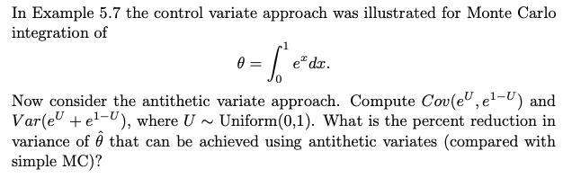
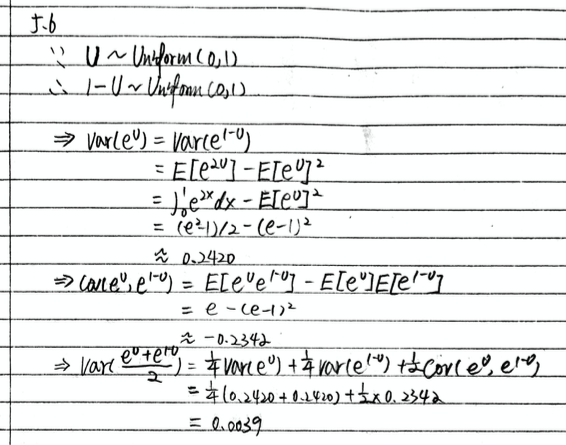
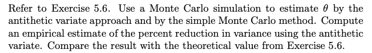
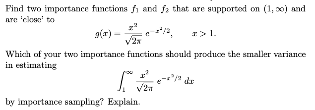
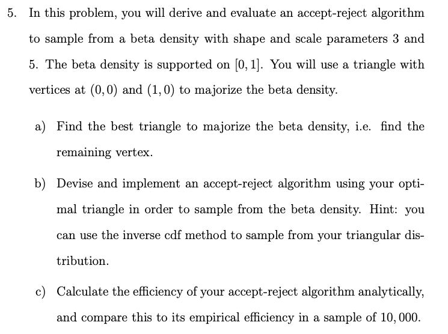
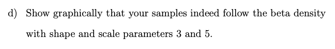

## 1. Problems 5.6 (Textbook: Statistical computing with R / Maria L. Rizzo.):



### What is the percent reduction in variance of theta that can be achieved using antithetic variates (compared with simple MC)?


```{r}
m <- 10000
U <- runif(m)
T1 <- U
T2 <- 1-U
mc.est <- mean(exp(U))
mc.var <- var(exp(U))
U.av <- cbind(T1, T2)
av.est <- mean(rowMeans(exp(U.av)))
av.var <- var(rowMeans(exp(U.av)))
1-(av.var/mc.var)
print(c("The percent reduction in variance: ","98.38%"))
```

## 2. Problems 5.7 (Textbook: Statistical computing with R / Maria L. Rizzo.):



### a). Use a Monte Carlo simulation to estimate theta by the antithetic variate approach and by the simple Monte Carlo method.
```{r}
#5.7
Aest <- c()
for(i in 1:100){
  U <- runif(10000)
  T1 <- exp(1 - U)
  T2 <- exp(U)
  Aest <- c(Aest, mean(rowMeans(cbind(T1,T2))))
}

MCest <- c()
for(i in 1:100){
  U <- runif(10000)
  MCest <- c(MCest, mean(exp(U)))
}

print(c("theta by the antithetic variate approach: ",mean(Aest),
        "theta by the simple Monte Carlo method: ",mean(MCest)))
```

### b). Compute an empirical estimate of the percent reduction in variance using the antithetic variate. Compare the result with the theoretical value from Exercise 5.6.
```{r}
(var(MCest) - var(Aest)) / var(MCest)
```

#### For the percent reduction in variance using:

* Theoretical value from Exercise 5.6: 98.38%
* Empirical estimate using the antithetic variate: 99.15%


## 3. Problems 5.13 (Textbook: Statistical computing with R / Maria L. Rizzo.):



```{r}
library(VGAM)

x = seq(0,5,0.1)

#f0
gx = function (x) {
  (x^2)/sqrt(2*pi)*exp(-x^2/2)
}
y_g = gx(x)

#f1
y_Rice = drice(x, sigma=1.5, vee=0)

#f2
y_norm = dnorm(x, mean = 1.5)

#f3
y_gamma = dgamma(x,shape=9,rate=6)

#Plot
plot(x, y_g, type = "l", ylim = c(0, 1))
lines(x, y_Rice, col="red", ylim = c(0, 1))
lines(x, y_norm, col="blue", ylim = c(0, 1))
lines(x, y_gamma, col="green", ylim = c(0, 1))
```

* Since function 1 (Rice Distribution) and function 2 (Normal Distribution) are closer to g(x), they should produce the smaller variance in estimation.

## 4. Problems 5.14 (Textbook: Statistical computing with R / Maria L. Rizzo.):


```{r}
n = 10000

#Theoritical estimation
theor_est = integrate(gx, 1, Inf)

#f1
x_Rice = rrice(n, sigma=1.5, vee=0)
f1_est = mean(gx(x_Rice)[x_Rice>1]/(drice(x_Rice, sigma=1.5, vee=0)[x_Rice>1]), na.rm = TRUE)

#f2
x_norm = rnorm(n, mean = 1.5)
f2_est = mean(gx(x_norm)[x_norm>1]/(dnorm(x_norm, mean = 1.5)[x_norm>1]), na.rm = TRUE)

#f3
x_gamma = rgamma(n, shape=9,rate=6)
f3_est = mean(gx(x_gamma)[x_gamma>1]/(dgamma(x_gamma,shape=9,rate=6)[x_gamma>1]), na.rm = TRUE)

print(c("Theoretical estimation: ",theor_est$value,
        "Estimation by Importance Function 1 (Rice Distribution): ",f1_est,
        "Estimation by Importance Function 2 (Normal Distribution): ",f2_est,
        "Estimation by Importance Function 3 (Gamma Distribution): ",f3_est))
```

## 5.



### a). Find the best triangle to majorize the beta density, i.e. find the remaining vertex.
```{r}
#First, generate probability from beta density on [0,1]
x <- seq(0,1,0.0001)
prob_dbeta <- dbeta(x,3,5)

#Then, for points on the density curve, find two points that 
#one is positively slopest to the (0,1) and the other is negatively slopest(1,0)
x_left <- c(0,0)
slope_left <- (prob_dbeta-x_left[2])/(x-x_left[1])
slope_left_max <- max(slope_left,na.rm=T) #8.6016
x_right <- c(1,0)
slope_right <- (prob_dbeta-x_right[2])/(x-x_right[1])
slope_right_max <- min(slope_right,na.rm=T) #-3.6288

#Plot the two lines with the slopes found
#And find the intersection point which is the remaining vertex
left_arm <-function(x){
  slope_left_max*x
}
right_arm <-function(x){
  slope_right_max*(x-1)
}
rt <- uniroot(function(x)  left_arm(x) - right_arm(x)  , c(0,11), tol=1e-8)     
#all.equal(left_arm(rt$root), right_arm(rt$root))

y_left <- left_arm(seq(0,rt$root,0.0001))
y_right <- right_arm(seq(rt$root,1,0.0001))

plot(x, prob_dbeta, type = "l", ylim = c(0, 3.5))
lines(seq(0,rt$root,0.0001), y_left, col="red", ylim = c(0, 3.5))
lines(seq(rt$root,1,0.0001), y_right, col="blue", ylim = c(0, 3.5))
points(rt$root,left_arm(rt$root))

rt$root
left_arm(rt$root)

print(c("The remaining vertex is: ",
        "(0.2967033,2.552123)",
        "which ensures the M very close to 1"))
```

### b). Implement an accept-reject algorithm
```{r}
#Calculate the inverse CDF of triangular distribution
#The area under the triangle is 8.6016*0.2967033/2 = 1.276062
invcdf_func <- function(u) {
  if (u >= 0 && u <= 0.2967033){
    0.544705*sqrt(u)
  }
  else if (u > 0.2967033 && u <= 1){
    1-0.000196578*(sqrt(1.82e7-1.81999e7*u))
  }
}

#Implement an accept-reject algorithm
f_x <- function(x) {
  dbeta(x,3,5)
}

g_x <- function(x) {
  if (x >= 0 && x <= rt$root){
    left_arm(x)
  }else if (x > rt$root && x <= 1){
    right_arm(x)
  }else{
    print("x needs to be ranged in [0,1].")
  }
}

m <- 10000
num_sampling <- 0
samples <- c()

while (num_sampling < m) {
  rand <- runif(1, 0, 1)
  x_c <- invcdf_func(rand)
  accept_prob <- f_x(x_c)/(g_x(x_c))
  u <- runif(1, 0, 1)
if (accept_prob >= u) {
  samples <- c(samples, x_c)
  num_sampling <- num_sampling + 1
      }
}
```

### c). Calculate the efficiency of your accept-reject algorithm analytically, and compare this to its empirical efficiency in a sample of 10000.
```{r}
ptm <- proc.time()
invcdf_func <- function(u) {
  if (u >= 0 && u <= 0.2967033){
    0.544705*sqrt(u)
  }
  else if (u > 0.2967033 && u <= 1){
    1-0.000196578*(sqrt(1.82e7-1.81999e7*u))
  }
}

#Implement an accept-reject algorithm
f_x <- function(x) {
  dbeta(x,3,5)
}

g_x <- function(x) {
  if (x >= 0 && x <= rt$root){
    left_arm(x)
  }else if (x > rt$root && x <= 1){
    right_arm(x)
  }else{
    print("x needs to be ranged in [0,1].")
  }
}

m <- 10000
num_sampling <- 0
samples <- c()

while (num_sampling < m) {
  rand <- runif(1, 0, 1)
  x_c <- invcdf_func(rand)
  accept_prob <- f_x(x_c)/(g_x(x_c))
  u <- runif(1, 0, 1)
if (accept_prob >= u) {
  samples <- c(samples, x_c)
  num_sampling <- num_sampling + 1
      }
}
run_time <- proc.time() - ptm

print("System Runing Time (second): ")
print(run_time)
```

### d). Show graphically that your samples indeed follow the beta density with shape and scale parameters 3 and 5.
```{r}
plot(x, prob_dbeta, type = "l", ylim = c(0, 3.5))
lines(seq(0,rt$root,0.0001), y_left, col="red", ylim = c(0, 3.5))
lines(seq(rt$root,1,0.0001), y_right, col="red", ylim = c(0, 3.5))
lines(density(samples), xlim=c(0,1), ylim=c(0,3.5), col = "green", xlab = "x", ylab="density")
```

Green curve is the density of the samples which fits the beta density very well.

