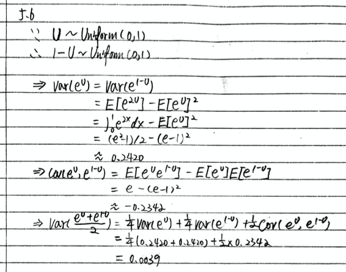
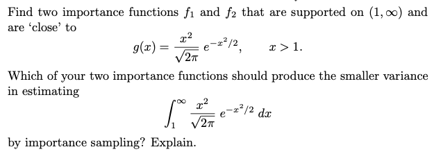
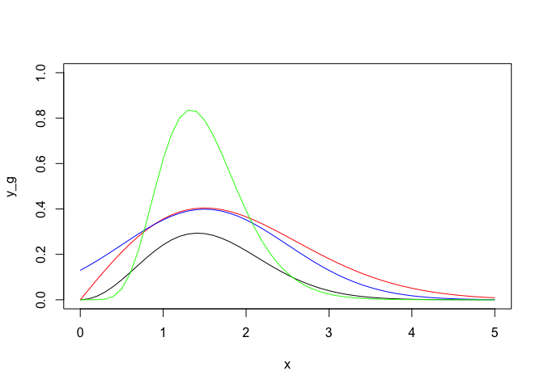
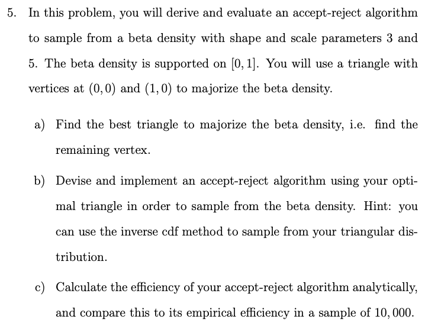
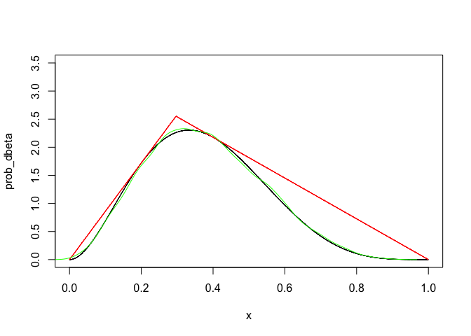

1. Problems 5.6 (Textbook: Statistical computing with R / Maria L. Rizzo.):
---------------------------------------------------------------------------

### What is the percent reduction in variance of theta that can be achieved using antithetic variates (compared with simple MC)?

    m <- 10000
    U <- runif(m)
    T1 <- U
    T2 <- 1-U
    mc.est <- mean(exp(U))
    mc.var <- var(exp(U))
    U.av <- cbind(T1, T2)
    av.est <- mean(rowMeans(exp(U.av)))
    av.var <- var(rowMeans(exp(U.av)))
    1-(av.var/mc.var)

    ## [1] 0.9838981

    print(c("The percent reduction in variance: ","98.38%"))

    ## [1] "The percent reduction in variance: "
    ## [2] "98.38%"

2. Problems 5.7 (Textbook: Statistical computing with R / Maria L. Rizzo.):
---------------------------------------------------------------------------

### a). Use a Monte Carlo simulation to estimate theta by the antithetic variate approach and by the simple Monte Carlo method.

    #5.7
    Aest <- c()
    for(i in 1:100){
      U <- runif(10000)
      T1 <- exp(1 - U)
      T2 <- exp(U)
      Aest <- c(Aest, mean(rowMeans(cbind(T1,T2))))
    }

    MCest <- c()
    for(i in 1:100){
      U <- runif(10000)
      MCest <- c(MCest, mean(exp(U)))
    }

    print(c("theta by the antithetic variate approach: ",mean(Aest),
            "theta by the simple Monte Carlo method: ",mean(MCest)))

    ## [1] "theta by the antithetic variate approach: "
    ## [2] "1.7182762316213"                           
    ## [3] "theta by the simple Monte Carlo method: "  
    ## [4] "1.71950111482807"

### b). Compute an empirical estimate of the percent reduction in variance using the antithetic variate. Compare the result with the theoretical value from Exercise 5.6.

    (var(MCest) - var(Aest)) / var(MCest)

    ## [1] 0.9900835

#### For the percent reduction in variance using:

-   Theoretical value from Exercise 5.6: 98.38%
-   Empirical estimate using the antithetic variate: 99.15%

3. Problems 5.13 (Textbook: Statistical computing with R / Maria L. Rizzo.):
----------------------------------------------------------------------------

    library(VGAM)

    ## Loading required package: stats4

    ## Loading required package: splines

    x = seq(0,5,0.1)

    #f0
    gx = function (x) {
      (x^2)/sqrt(2*pi)*exp(-x^2/2)
    }
    y_g = gx(x)

    #f1
    y_Rice = drice(x, sigma=1.5, vee=0)

    #f2
    y_norm = dnorm(x, mean = 1.5)

    #f3
    y_gamma = dgamma(x,shape=9,rate=6)

    #Plot
    plot(x, y_g, type = "l", ylim = c(0, 1))
    lines(x, y_Rice, col="red", ylim = c(0, 1))
    lines(x, y_norm, col="blue", ylim = c(0, 1))
    lines(x, y_gamma, col="green", ylim = c(0, 1))

-   Since function 1 (Rice Distribution) and function 2 (Normal
    Distribution) are closer to g(x), they should produce the smaller
    variance in estimation.

4. Problems 5.14 (Textbook: Statistical computing with R / Maria L. Rizzo.):
----------------------------------------------------------------------------

    n = 10000

    #Theoritical estimation
    theor_est = integrate(gx, 1, Inf)

    #f1
    x_Rice = rrice(n, sigma=1.5, vee=0)
    f1_est = mean(gx(x_Rice)[x_Rice>1]/(drice(x_Rice, sigma=1.5, vee=0)[x_Rice>1]), na.rm = TRUE)

    #f2
    x_norm = rnorm(n, mean = 1.5)
    f2_est = mean(gx(x_norm)[x_norm>1]/(dnorm(x_norm, mean = 1.5)[x_norm>1]), na.rm = TRUE)

    #f3
    x_gamma = rgamma(n, shape=9,rate=6)
    f3_est = mean(gx(x_gamma)[x_gamma>1]/(dgamma(x_gamma,shape=9,rate=6)[x_gamma>1]), na.rm = TRUE)

    print(c("Theoretical estimation: ",theor_est$value,
            "Estimation by Importance Function 1 (Rice Distribution): ",f1_est,
            "Estimation by Importance Function 2 (Normal Distribution): ",f2_est,
            "Estimation by Importance Function 3 (Gamma Distribution): ",f3_est))

    ## [1] "Theoretical estimation: "                                   
    ## [2] "0.400625978474506"                                          
    ## [3] "Estimation by Importance Function 1 (Rice Distribution): "  
    ## [4] "0.500252510987078"                                          
    ## [5] "Estimation by Importance Function 2 (Normal Distribution): "
    ## [6] "0.584001470805931"                                          
    ## [7] "Estimation by Importance Function 3 (Gamma Distribution): " 
    ## [8] "0.47833302530692"

5.
--

 

### a). Find the best triangle to majorize the beta density, i.e. find the remaining vertex.

    #First, generate probability from beta density on [0,1]
    x <- seq(0,1,0.0001)
    prob_dbeta <- dbeta(x,3,5)

    #Then, for points on the density curve, find two points that 
    #one is positively slopest to the (0,1) and the other is negatively slopest(1,0)
    x_left <- c(0,0)
    slope_left <- (prob_dbeta-x_left[2])/(x-x_left[1])
    slope_left_max <- max(slope_left,na.rm=T) #8.6016
    x_right <- c(1,0)
    slope_right <- (prob_dbeta-x_right[2])/(x-x_right[1])
    slope_right_max <- min(slope_right,na.rm=T) #-3.6288

    #Plot the two lines with the slopes found
    #And find the intersection point which is the remaining vertex
    left_arm <-function(x){
      slope_left_max*x
    }
    right_arm <-function(x){
      slope_right_max*(x-1)
    }
    rt <- uniroot(function(x)  left_arm(x) - right_arm(x)  , c(0,11), tol=1e-8)     
    #all.equal(left_arm(rt$root), right_arm(rt$root))

    y_left <- left_arm(seq(0,rt$root,0.0001))
    y_right <- right_arm(seq(rt$root,1,0.0001))

    plot(x, prob_dbeta, type = "l", ylim = c(0, 3.5))
    lines(seq(0,rt$root,0.0001), y_left, col="red", ylim = c(0, 3.5))
    lines(seq(rt$root,1,0.0001), y_right, col="blue", ylim = c(0, 3.5))
    points(rt$root,left_arm(rt$root))

    rt$root

    ## [1] 0.2967033

    left_arm(rt$root)

    ## [1] 2.552123

    print(c("The remaining vertex is: ",
            "(0.2967033,2.552123)",
            "which ensures the M very close to 1"))

    ## [1] "The remaining vertex is: "          
    ## [2] "(0.2967033,2.552123)"               
    ## [3] "which ensures the M very close to 1"

### b). Implement an accept-reject algorithm

    #Calculate the inverse CDF of triangular distribution
    #The area under the triangle is 8.6016*0.2967033/2 = 1.276062
    invcdf_func <- function(u) {
      if (u >= 0 && u <= 0.2967033){
        0.544705*sqrt(u)
      }
      else if (u > 0.2967033 && u <= 1){
        1-0.000196578*(sqrt(1.82e7-1.81999e7*u))
      }
    }

    #Implement an accept-reject algorithm
    f_x <- function(x) {
      dbeta(x,3,5)
    }

    g_x <- function(x) {
      if (x >= 0 && x <= rt$root){
        left_arm(x)
      }else if (x > rt$root && x <= 1){
        right_arm(x)
      }else{
        print("x needs to be ranged in [0,1].")
      }
    }

    m <- 10000
    num_sampling <- 0
    samples <- c()

    while (num_sampling < m) {
      rand <- runif(1, 0, 1)
      x_c <- invcdf_func(rand)
      accept_prob <- f_x(x_c)/(g_x(x_c))
      u <- runif(1, 0, 1)
    if (accept_prob >= u) {
      samples <- c(samples, x_c)
      num_sampling <- num_sampling + 1
          }
    }

### c). Calculate the efficiency of your accept-reject algorithm analytically, and compare this to its empirical efficiency in a sample of 10000.

    ptm <- proc.time()
    invcdf_func <- function(u) {
      if (u >= 0 && u <= 0.2967033){
        0.544705*sqrt(u)
      }
      else if (u > 0.2967033 && u <= 1){
        1-0.000196578*(sqrt(1.82e7-1.81999e7*u))
      }
    }

    #Implement an accept-reject algorithm
    f_x <- function(x) {
      dbeta(x,3,5)
    }

    g_x <- function(x) {
      if (x >= 0 && x <= rt$root){
        left_arm(x)
      }else if (x > rt$root && x <= 1){
        right_arm(x)
      }else{
        print("x needs to be ranged in [0,1].")
      }
    }

    m <- 10000
    num_sampling <- 0
    samples <- c()

    while (num_sampling < m) {
      rand <- runif(1, 0, 1)
      x_c <- invcdf_func(rand)
      accept_prob <- f_x(x_c)/(g_x(x_c))
      u <- runif(1, 0, 1)
    if (accept_prob >= u) {
      samples <- c(samples, x_c)
      num_sampling <- num_sampling + 1
          }
    }
    run_time <- proc.time() - ptm

    print("System Runing Time (second): ")

    ## [1] "System Runing Time (second): "

    print(run_time)

    ##    user  system elapsed 
    ##   0.313   0.148   0.460

### d). Show graphically that your samples indeed follow the beta density with shape and scale parameters 3 and 5.

    plot(x, prob_dbeta, type = "l", ylim = c(0, 3.5))
    lines(seq(0,rt$root,0.0001), y_left, col="red", ylim = c(0, 3.5))
    lines(seq(rt$root,1,0.0001), y_right, col="red", ylim = c(0, 3.5))
    lines(density(samples), xlim=c(0,1), ylim=c(0,3.5), col = "green", xlab = "x", ylab="density")

Green curve is the density of the samples which fits the beta density
very well.
