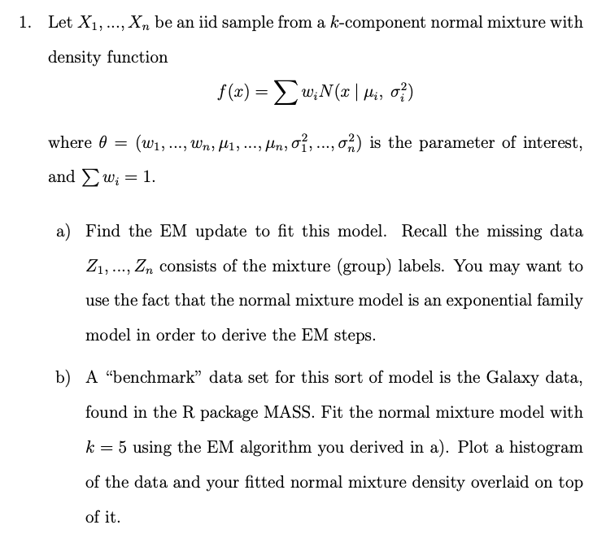
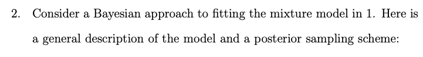
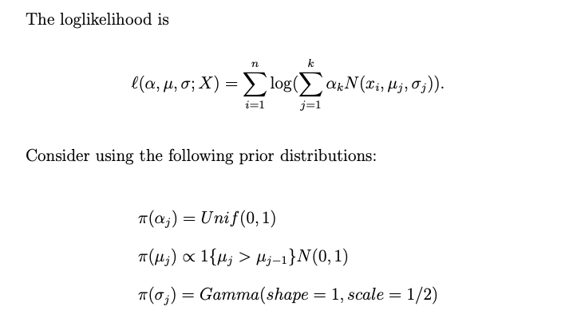
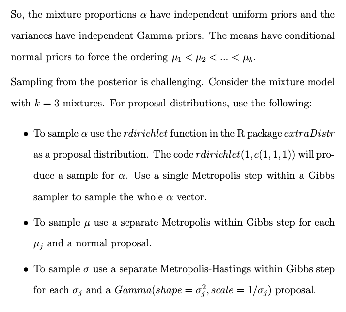
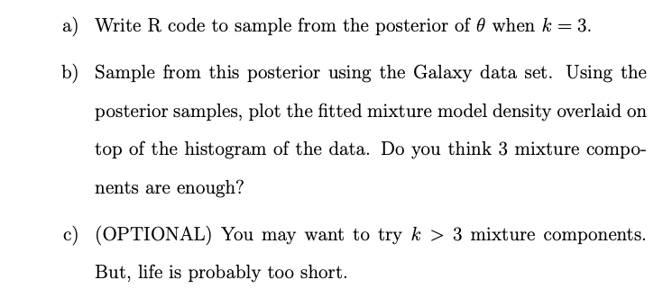
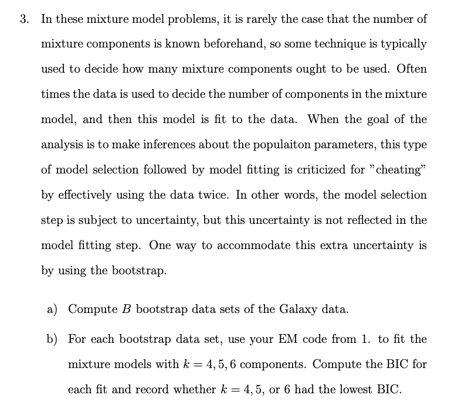
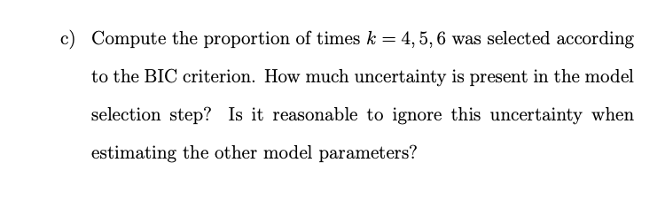

  
## 1.


### a). Find the EM update to fit this model.
```{r}
E_M_Norm_Mix <- function(y, iter, K)
{ 
  # initialization by random assignments
  p <- c()
  sigma <- c()
  clusters <- kmeans(y, K)
  for (i in 1:K){
    c <- y[clusters$cluster == i]
    prob <- (length(c)/length(y))
    p <- c(p,prob)
    sigma <- c(sigma,sd(c))
  }
  mu <- as.vector(clusters$centers)
  
  data_mat <- matrix(NA,length(y),K)
  for (i in 1:K){
    data_mat[,i] <- dnorm(y,mu[i],sigma[i])
  }
  alpha <- matrix(p,K,1)
  likelihood <- sum(log(data_mat %*% alpha))
  result <- matrix(NA,iter,2+K*4)
  result[1,] <- c(0, p, mu, sigma, alpha,likelihood)
  
  
  tol <- 1e-08
  k = 2
  repeat {
    # E-Step

    t <- matrix(NA,length(y),K)
    for (i in 1:K){
      d <- data_mat[,i] * alpha[i]
      t[,i] <- d/data_mat %*% alpha
    }
    
    # M-Step
    for (i in 1:K){
      p[i] <- mean(t[,i])
      mu[i] <- sum(t[,i]*y)/sum(t[,i])
      sigma[i] <-sqrt(sum(t[,i]*(y^2))/sum(t[,i])-(mu[i])^2)
    }
    
    data_mat <- matrix(NA,length(y),K)
    for (i in 1:K){
      data_mat[,i] <- dnorm(y,mu[i],sigma[i])
    }
    alpha <- matrix(p,K,1)
    
    #Likelihood
    likelihood <- sum(log(data_mat %*% alpha))
    
    #Output
    result[k,] <- c(k, p, mu, sigma, alpha, likelihood)
    
    #Stop Criterion
    if(abs(result[k,2+3*K] - result[k-1,2+3*K]) < tol || k >= iter) break else k <- k + 1
    
  }
  result <- data.frame(result)

  result <- na.omit(result)
  output <- list(parameters=c(p, mu, sigma, alpha), likelihood=likelihood, result=result)
  return(output)
}
```

### b).





```{r}
library(MASS)

model_result <- E_M_Norm_Mix(galaxies, iter=500, K=5)

parameters <- as.numeric(model_result$result[length(model_result$result),7:21])
parameters <- list(mu=parameters[1:5],sigma=parameters[6:10],alpha=parameters[11:15])


library(magrittr)
library(ggplot2)

plot_mix_comps <- function(x, mu, sigma, alpha, k) {
  f <- 0*x
  for (i in 1:k){
    f <- f+alpha[i] * dnorm(x, mu[i], sigma[i])
  }
  return(f)
}

alpha = parameters$alpha
sigma = parameters$sigma
mu = parameters$mu

data.frame(x = galaxies) %>%
  ggplot() +
  geom_histogram(aes(x, ..density..), binwidth = 500, colour = "black", 
                 fill = "white") +
  stat_function(geom = "line", fun = plot_mix_comps,
                args = list(mu, sigma, alpha, 5),
                colour = "blue", lwd = 1.5) +
  ylab("Density") +
  xlab("Values") +
  ggtitle("Normal Mixture Fit")
```


## 2.

### a).
```{r}
library(extraDistr)

mixture.pdf <- function(x,a,mu,sigma){
  f = 0*x
  for (i in 1:3){
    f <- f+(a[i]*dnorm(x,mu[i],sigma[i]))
  }
  return(f)
}

apply.mixture.pdf <- function(x,a,mu,sigma) apply(matrix(x,length(x),1),1,mixture.pdf, a=a,mu=mu,sigma=sigma)

prior <- function(a,mu,sigma){
  p.a <- prod(dunif(a,0,1))
  p.sigma <- prod(dgamma(sigma,shape=1,scale=0.5))
  if (mu[1] < mu[2] & mu[2] < mu[3]){
    p.mu <- prod(dnorm(mu,0,1))
    return(p.a*p.mu*p.sigma)
  }else{
    return(0)
  }
}

log.post <- function(x,a,mu,sigma) {
  loglike <- sum(log(apply.mixture.pdf(x,a,mu,sigma)))
  log_prior <- log(prior(a,mu,sigma))
  if (log_prior == -Inf){
    return(loglike)
  }else{
    return(loglike+log_prior)
  }
}


dprop1 <- function(x) ddirichlet(x, c(1, 1, 1))
dprop2 <- function(x,m) dnorm(x,m,2)
dprop3 <- function(x,sigma) dgamma(x,shape=sigma^2,scale=(1/sigma))

rprop1 <- function() rdirichlet(1, c(1, 1, 1))
rprop2 <- function(m) rnorm(1,m,2)
rprop3 <- function(sigma) rgamma(1,shape=sigma^2,scale=(1/sigma))


mh.in.gibbs <- function(x,a,mu,sigma,N){
  samples <- matrix(0,N,9)
  samples[1,] = c(a,mu,sigma)
  ct1 <- ct2 <- ct3 <- ct4<- ct5<- ct6<- ct7<- 0
  for(i in 2:N){
    # sampling a
    log.post.a <- function(a) log.post(x, a, samples[i-1,4:6], samples[i-1,7:9])
    a.star <- rprop1()
    u <- runif(1)
    if(u <= min(1,exp(log.post.a(a.star)-log.post.a(samples[i-1,1:3]) 
                      - log(dprop1(a.star))+log(dprop1(samples[i-1,1:3]))))){
      samples[i,1:3] <- a.star
      ct1<-ct1+1
    }else {
      samples[i,1:3] <- samples[i-1,1:3]
    }
    

    #sampling mu1
    log.post.mu1 <- function(mu1) log.post(x, samples[i,1:3], c(mu1,samples[i-1,5:6]), samples[i-1,7:9])
    mu1.star <- rprop2(samples[i-1,4])
    u <- runif(1)
    if(u <= min(1,exp(log.post.mu1(mu1.star)-log.post.mu1(samples[i-1,4])- log(dprop2(mu1.star,samples[i-1,4]))+log(dprop2(samples[i-1,4],mu1.star))))){
      samples[i,4] <- mu1.star
      ct2<-ct2+1
    }else {
      samples[i,4] <- samples[i-1,4]
    }
    
    
    #sampling mu2
    log.post.mu2 <- function(mu2) log.post(x,samples[i,1:3], 
                                           c(samples[i-1,4],mu2,samples[i-1,6]), samples[i-1,c(7:9)])
    mu2.star <- rprop2(samples[i-1,5])
    u <- runif(1)
    if(u <= min(1,exp(log.post.mu2(mu2.star)-log.post.mu2(samples[i-1,5])-
                      log(dprop2(mu2.star,samples[i-1,5]))+log(dprop2(samples[i-1,5],mu2.star))))){
      samples[i,5] <- mu2.star
      ct3<-ct3+1
    }else {
      samples[i,5] <- samples[i-1,5]
    }
    
    #sampling mu3
    log.post.mu3 <- function(mu3) log.post(x, samples[i,1:3], c(samples[i-1,4:5],mu3), samples[i-1,c(7:9)])
    mu3.star <- rprop2(samples[i-1,6])
    u <- runif(1)
    if(u <= min(1,exp(log.post.mu3(mu3.star)-log.post.mu3(samples[i-1,6])- log(dprop2(mu3.star,samples[i-1,6]))+log(dprop2(samples[i-1,6],mu3.star))))){
      samples[i,6] <- mu3.star
      ct4<-ct4+1
    }else {
      samples[i,6] <- samples[i-1,6]
    }
    
    
    #sampling s1
    log.post.s1 <- function(s1) log.post(x, samples[i,1:3],
                                         samples[i,c(4:6)], c(s1,samples[i-1,c(8:9)]))
    s1.star <- rprop3(samples[i-1,7])
    u <- runif(1)
    if(u <= min(1,exp(log.post.s1(s1.star)-log.post.s1(samples[i-1,7])))){
      samples[i,7] <- s1.star
      ct5<-ct5+1
    }else {
      samples[i,7] <- samples[i-1,7]
    }
    
    #sampling s2
    log.post.s2 <- function(s2) log.post(x, samples[i,1:3], 
                                         samples[i,c(4:7,9)], c(samples[i-1,c(7)],s2,samples[i-1,c(9)]))
    s2.star <- rprop3(samples[i-1,8])
    u <- runif(1)
    if(u <= min(1,exp(log.post.s2(s2.star)-log.post.s2(samples[i-1,8])))){
      samples[i,8] <- s2.star
      ct6<-ct6+1
    }else {
      samples[i,8] <- samples[i-1,8]
    }
    
    #sampling s3
    log.post.s3 <- function(s3) log.post(x, samples[i,1:3], samples[i,c(4:8)], c(samples[i-1,c(7:8)],s3))
    s3.star <- rprop3(samples[i-1,9])
    u <- runif(1)
    if(u <= min(1,exp(log.post.s3(s3.star)-log.post.s3(samples[i-1,9])))){
      samples[i,9] <- s3.star
      ct7<-ct7+1
    }else {
      samples[i,9] <- samples[i-1,9]
    }
  }
  return(list(counts = c(ct1, ct2, ct3,ct4,ct5,ct6,ct7), samples = samples))
}
```

### b).
```{r}
library(evd)
data <- galaxies
N<-1000
a=c(0.6585366,0.25609756,0.08536585)
mu = c(9710.143,20241.20,25115.16)
sigma =c(1521.900,3322.6017,456.3637)
post.samples <- mh.in.gibbs(data, a, mu, sigma, N)

post.samples$counts/N

hist(post.samples$samples[,1], main = "a")
abline(v = 4, lwd=3)
hist(post.samples$samples[,2], main = "s")
abline(v = 3, lwd=3)
hist(post.samples$samples[,3], main = "m")
abline(v = 2, lwd=3)
```

## 3.



### a).
```{r}
E_M_Norm_Mix <- function(y, iter, K)
{ 
  # initialization by random assignments
  p <- c()
  sigma <- c()
  clusters <- kmeans(y, K)
  for (i in 1:K){
    c <- y[clusters$cluster == i]
    prob <- (length(c)/length(y))
    p <- c(p,prob)
    #sigma <- c(sigma,sd(c))
    sd_c <- ifelse((sd(c)==0 | is.na(sd(c))), 0.1,sd(c))
    sigma <- c(sigma,sd_c)
  }
  mu <- as.vector(clusters$centers)
  
  data_mat <- matrix(NA,length(y),K)
  for (i in 1:K){
    data_mat[,i] <- dnorm(y,mu[i],sigma[i])
  }
  alpha <- matrix(p,K,1)
  likelihood <- sum(log(data_mat %*% alpha))
  result <- matrix(NA,iter,2+K*3)
  result[1,] <- c(0, p, mu, sigma, likelihood)
  
  
  tol <- 1e-08
  k = 2
  bic <- NA
  tryCatch({
    repeat {
      
      # E-Step
      
      t <- matrix(NA,length(y),K)
      for (i in 1:K){
        d <- data_mat[,i] * alpha[i]
        t[,i] <- d/data_mat %*% alpha
      }
      
      # M-Step
      for (i in 1:K){
        p[i] <- mean(t[,i])
        mu[i] <- sum(t[,i]*y)/sum(t[,i])
        sd_c <-sqrt(sum(t[,i]*(y^2))/sum(t[,i])-(mu[i])^2)
        sd_c <- ifelse((sd_c==0 | is.na(sd_c)), 0.1,sd_c)
        sigma[i] <- sd_c
      }
      
      data_mat <- matrix(NA,length(y),K)
      for (i in 1:K){
        data_mat[,i] <- dnorm(y,mu[i],sigma[i])
      }
      alpha <- matrix(p,K,1)
      
      #Likelihood
      likelihood <- sum(log(data_mat %*% alpha))
      
      #Output
      result[k,] <- c(k, p, mu, sigma, likelihood)
      
      #Stop Criterion
      if(abs(result[k,2+3*K] - result[k-1,2+3*K]) < tol || k >= iter){
        bic <- 2*(likelihood) - log(length(y))*(3*K)
        break }
      else {
        k <- k + 1
      }
    }
  },
  error = function(cond){
    #print("Skip")
  })
  return(bic)
}
```

### b). Compute the BIC for each fit and record whether k = 4, 5, or 6 had the lowest BIC.
```{r}
B = 1000
bic_result <- matrix(NA,B,3)
for (i in 1:B){
  for (j in 4:6){
    resample <- sample(galaxies, replace = TRUE)
    bic_result[i,j-3] <- E_M_Norm_Mix(resample,500, K=j)
  }
}

```

### c). Compute the proportion of times k = 4, 5, 6 was selected according to the BIC criterion.
```{r}
bic_stat <- apply(bic_result,1,which.min)
print(c("Ratio of k=4,5,6 which has lowest BIC"))
print(c(sum(bic_stat==1)/B,sum(bic_stat==2)/B,sum(bic_stat==3)/B))
```

Since the BIC picks k = 4, there is a little uncertainty and we should not ignore uncertainty when estimate parameters.

