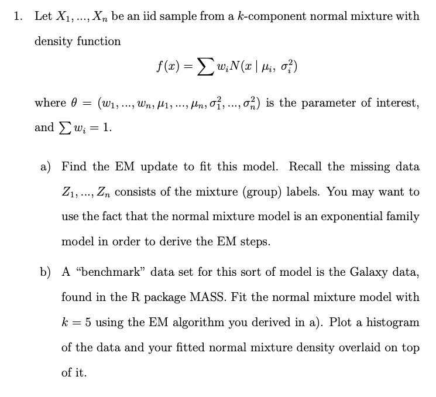
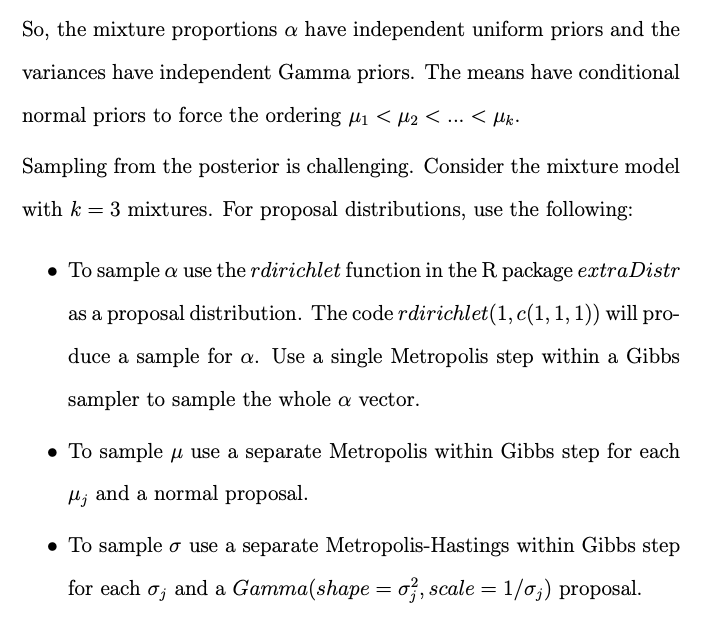
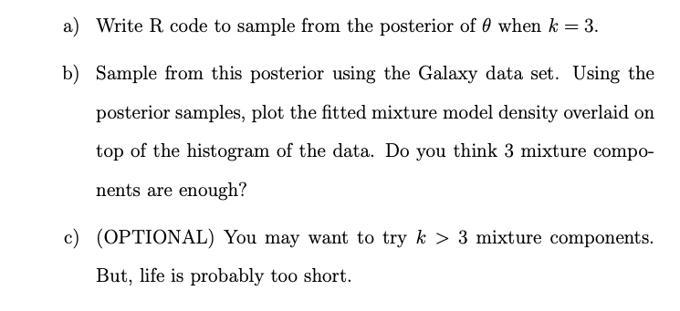
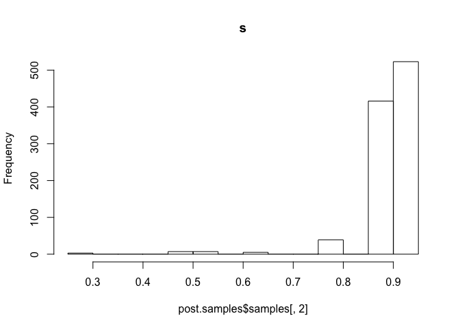
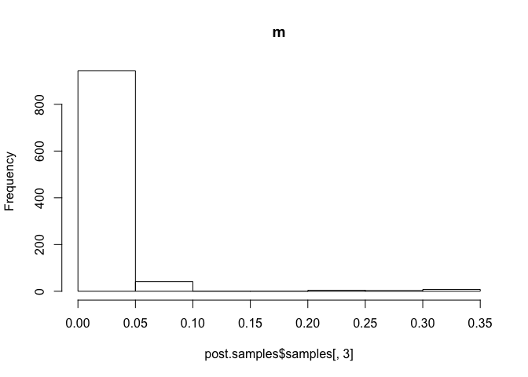

## Topics
EM update algorithm to fit a k-Component Normal Mixture Model, Bayesian approach to fitting Normal Mixture Model, Posterior Sampling, Metropolis Sampling within Gibbs step, Metropolis-Hastings Sampling within Gibbs step, BIC

## Problem 1.

### a). Find the EM update to fit this model.

    E_M_Norm_Mix <- function(y, iter, K)
    { 
      # initialization by random assignments
      p <- c()
      sigma <- c()
      clusters <- kmeans(y, K)
      for (i in 1:K){
        c <- y[clusters$cluster == i]
        prob <- (length(c)/length(y))
        p <- c(p,prob)
        sigma <- c(sigma,sd(c))
      }
      mu <- as.vector(clusters$centers)
      
      data_mat <- matrix(NA,length(y),K)
      for (i in 1:K){
        data_mat[,i] <- dnorm(y,mu[i],sigma[i])
      }
      alpha <- matrix(p,K,1)
      likelihood <- sum(log(data_mat %*% alpha))
      result <- matrix(NA,iter,2+K*4)
      result[1,] <- c(0, p, mu, sigma, alpha,likelihood)
      
      
      tol <- 1e-08
      k = 2
      repeat {
        # E-Step

        t <- matrix(NA,length(y),K)
        for (i in 1:K){
          d <- data_mat[,i] * alpha[i]
          t[,i] <- d/data_mat %*% alpha
        }
        
        # M-Step
        for (i in 1:K){
          p[i] <- mean(t[,i])
          mu[i] <- sum(t[,i]*y)/sum(t[,i])
          sigma[i] <-sqrt(sum(t[,i]*(y^2))/sum(t[,i])-(mu[i])^2)
        }
        
        data_mat <- matrix(NA,length(y),K)
        for (i in 1:K){
          data_mat[,i] <- dnorm(y,mu[i],sigma[i])
        }
        alpha <- matrix(p,K,1)
        
        #Likelihood
        likelihood <- sum(log(data_mat %*% alpha))
        
        #Output
        result[k,] <- c(k, p, mu, sigma, alpha, likelihood)
        
        #Stop Criterion
        if(abs(result[k,2+3*K] - result[k-1,2+3*K]) < tol || k >= iter) break else k <- k + 1
        
      }
      result <- data.frame(result)

      result <- na.omit(result)
      output <- list(parameters=c(p, mu, sigma, alpha), likelihood=likelihood, result=result)
      return(output)
    }

### b).

  

    library(MASS)

    model_result <- E_M_Norm_Mix(galaxies, iter=500, K=5)

    parameters <- as.numeric(model_result$result[length(model_result$result),7:21])
    parameters <- list(mu=parameters[1:5],sigma=parameters[6:10],alpha=parameters[11:15])

    library(magrittr)
    library(ggplot2)

    plot_mix_comps <- function(x, mu, sigma, alpha, k) {
      f <- 0*x
      for (i in 1:k){
        f <- f+alpha[i] * dnorm(x, mu[i], sigma[i])
      }
      return(f)
    }

    alpha = parameters$alpha
    sigma = parameters$sigma
    mu = parameters$mu

    data.frame(x = galaxies) %>%
      ggplot() +
      geom_histogram(aes(x, ..density..), binwidth = 500, colour = "black", 
                     fill = "white") +
      stat_function(geom = "line", fun = plot_mix_comps,
                    args = list(mu, sigma, alpha, 5),
                    colour = "blue", lwd = 1.5) +
      ylab("Density") +
      xlab("Values") +
      ggtitle("Normal Mixture Fit")

## Problem 2.

### a).

    library(extraDistr)

    mixture.pdf <- function(x,a,mu,sigma){
      f = 0*x
      for (i in 1:3){
        f <- f+(a[i]*dnorm(x,mu[i],sigma[i]))
      }
      return(f)
    }

    apply.mixture.pdf <- function(x,a,mu,sigma) apply(matrix(x,length(x),1),1,mixture.pdf, a=a,mu=mu,sigma=sigma)

    prior <- function(a,mu,sigma){
      p.a <- prod(dunif(a,0,1))
      p.sigma <- prod(dgamma(sigma,shape=1,scale=0.5))
      if (mu[1] < mu[2] & mu[2] < mu[3]){
        p.mu <- prod(dnorm(mu,0,1))
        return(p.a*p.mu*p.sigma)
      }else{
        return(0)
      }
    }

    log.post <- function(x,a,mu,sigma) {
      loglike <- sum(log(apply.mixture.pdf(x,a,mu,sigma)))
      log_prior <- log(prior(a,mu,sigma))
      if (log_prior == -Inf){
        return(loglike)
      }else{
        return(loglike+log_prior)
      }
    }

    dprop1 <- function(x) ddirichlet(x, c(1, 1, 1))
    dprop2 <- function(x,m) dnorm(x,m,2)
    dprop3 <- function(x,sigma) dgamma(x,shape=sigma^2,scale=(1/sigma))

    rprop1 <- function() rdirichlet(1, c(1, 1, 1))
    rprop2 <- function(m) rnorm(1,m,2)
    rprop3 <- function(sigma) rgamma(1,shape=sigma^2,scale=(1/sigma))

    mh.in.gibbs <- function(x,a,mu,sigma,N){
      samples <- matrix(0,N,9)
      samples[1,] = c(a,mu,sigma)
      ct1 <- ct2 <- ct3 <- ct4<- ct5<- ct6<- ct7<- 0
      for(i in 2:N){
        # sampling a
        log.post.a <- function(a) log.post(x, a, samples[i-1,4:6], samples[i-1,7:9])
        a.star <- rprop1()
        u <- runif(1)
        if(u <= min(1,exp(log.post.a(a.star)-log.post.a(samples[i-1,1:3]) 
                          - log(dprop1(a.star))+log(dprop1(samples[i-1,1:3]))))){
          samples[i,1:3] <- a.star
          ct1<-ct1+1
        }else {
          samples[i,1:3] <- samples[i-1,1:3]
        }
        

        #sampling mu1
        log.post.mu1 <- function(mu1) log.post(x, samples[i,1:3], c(mu1,samples[i-1,5:6]), samples[i-1,7:9])
        mu1.star <- rprop2(samples[i-1,4])
        u <- runif(1)
        if(u <= min(1,exp(log.post.mu1(mu1.star)-log.post.mu1(samples[i-1,4])- log(dprop2(mu1.star,samples[i-1,4]))+log(dprop2(samples[i-1,4],mu1.star))))){
          samples[i,4] <- mu1.star
          ct2<-ct2+1
        }else {
          samples[i,4] <- samples[i-1,4]
        }
        
        
        #sampling mu2
        log.post.mu2 <- function(mu2) log.post(x,samples[i,1:3], 
                                               c(samples[i-1,4],mu2,samples[i-1,6]), samples[i-1,c(7:9)])
        mu2.star <- rprop2(samples[i-1,5])
        u <- runif(1)
        if(u <= min(1,exp(log.post.mu2(mu2.star)-log.post.mu2(samples[i-1,5])-
                          log(dprop2(mu2.star,samples[i-1,5]))+log(dprop2(samples[i-1,5],mu2.star))))){
          samples[i,5] <- mu2.star
          ct3<-ct3+1
        }else {
          samples[i,5] <- samples[i-1,5]
        }
        
        #sampling mu3
        log.post.mu3 <- function(mu3) log.post(x, samples[i,1:3], c(samples[i-1,4:5],mu3), samples[i-1,c(7:9)])
        mu3.star <- rprop2(samples[i-1,6])
        u <- runif(1)
        if(u <= min(1,exp(log.post.mu3(mu3.star)-log.post.mu3(samples[i-1,6])- log(dprop2(mu3.star,samples[i-1,6]))+log(dprop2(samples[i-1,6],mu3.star))))){
          samples[i,6] <- mu3.star
          ct4<-ct4+1
        }else {
          samples[i,6] <- samples[i-1,6]
        }
        
        
        #sampling s1
        log.post.s1 <- function(s1) log.post(x, samples[i,1:3],
                                             samples[i,c(4:6)], c(s1,samples[i-1,c(8:9)]))
        s1.star <- rprop3(samples[i-1,7])
        u <- runif(1)
        if(u <= min(1,exp(log.post.s1(s1.star)-log.post.s1(samples[i-1,7])))){
          samples[i,7] <- s1.star
          ct5<-ct5+1
        }else {
          samples[i,7] <- samples[i-1,7]
        }
        
        #sampling s2
        log.post.s2 <- function(s2) log.post(x, samples[i,1:3], 
                                             samples[i,c(4:7,9)], c(samples[i-1,c(7)],s2,samples[i-1,c(9)]))
        s2.star <- rprop3(samples[i-1,8])
        u <- runif(1)
        if(u <= min(1,exp(log.post.s2(s2.star)-log.post.s2(samples[i-1,8])))){
          samples[i,8] <- s2.star
          ct6<-ct6+1
        }else {
          samples[i,8] <- samples[i-1,8]
        }
        
        #sampling s3
        log.post.s3 <- function(s3) log.post(x, samples[i,1:3], samples[i,c(4:8)], c(samples[i-1,c(7:8)],s3))
        s3.star <- rprop3(samples[i-1,9])
        u <- runif(1)
        if(u <= min(1,exp(log.post.s3(s3.star)-log.post.s3(samples[i-1,9])))){
          samples[i,9] <- s3.star
          ct7<-ct7+1
        }else {
          samples[i,9] <- samples[i-1,9]
        }
      }
      return(list(counts = c(ct1, ct2, ct3,ct4,ct5,ct6,ct7), samples = samples))
    }

### b).

    library(evd)

    ## 
    ## Attaching package: 'evd'

    ## The following objects are masked from 'package:extraDistr':
    ## 
    ##     dfrechet, dgev, dgpd, dgumbel, pfrechet, pgev, pgpd, pgumbel,
    ##     qfrechet, qgev, qgpd, qgumbel, rfrechet, rgev, rgpd, rgumbel

    data <- galaxies
    N<-1000
    a=c(0.6585366,0.25609756,0.08536585)
    mu = c(9710.143,20241.20,25115.16)
    sigma =c(1521.900,3322.6017,456.3637)
    post.samples <- mh.in.gibbs(data, a, mu, sigma, N)

    post.samples$counts/N

    ## [1] 0.014 0.999 0.998 0.998 0.996 0.999 0.999

    hist(post.samples$samples[,1], main = "a")
    abline(v = 4, lwd=3)

    hist(post.samples$samples[,2], main = "s")
    abline(v = 3, lwd=3)

    hist(post.samples$samples[,3], main = "m")
    abline(v = 2, lwd=3)

## Problem 3.

 

### a).

    E_M_Norm_Mix <- function(y, iter, K)
    { 
      # initialization by random assignments
      p <- c()
      sigma <- c()
      clusters <- kmeans(y, K)
      for (i in 1:K){
        c <- y[clusters$cluster == i]
        prob <- (length(c)/length(y))
        p <- c(p,prob)
        #sigma <- c(sigma,sd(c))
        sd_c <- ifelse((sd(c)==0 | is.na(sd(c))), 0.1,sd(c))
        sigma <- c(sigma,sd_c)
      }
      mu <- as.vector(clusters$centers)
      
      data_mat <- matrix(NA,length(y),K)
      for (i in 1:K){
        data_mat[,i] <- dnorm(y,mu[i],sigma[i])
      }
      alpha <- matrix(p,K,1)
      likelihood <- sum(log(data_mat %*% alpha))
      result <- matrix(NA,iter,2+K*3)
      result[1,] <- c(0, p, mu, sigma, likelihood)
      
      
      tol <- 1e-08
      k = 2
      bic <- NA
      tryCatch({
        repeat {
          
          # E-Step
          
          t <- matrix(NA,length(y),K)
          for (i in 1:K){
            d <- data_mat[,i] * alpha[i]
            t[,i] <- d/data_mat %*% alpha
          }
          
          # M-Step
          for (i in 1:K){
            p[i] <- mean(t[,i])
            mu[i] <- sum(t[,i]*y)/sum(t[,i])
            sd_c <-sqrt(sum(t[,i]*(y^2))/sum(t[,i])-(mu[i])^2)
            sd_c <- ifelse((sd_c==0 | is.na(sd_c)), 0.1,sd_c)
            sigma[i] <- sd_c
          }
          
          data_mat <- matrix(NA,length(y),K)
          for (i in 1:K){
            data_mat[,i] <- dnorm(y,mu[i],sigma[i])
          }
          alpha <- matrix(p,K,1)
          
          #Likelihood
          likelihood <- sum(log(data_mat %*% alpha))
          
          #Output
          result[k,] <- c(k, p, mu, sigma, likelihood)
          
          #Stop Criterion
          if(abs(result[k,2+3*K] - result[k-1,2+3*K]) < tol || k >= iter){
            bic <- 2*(likelihood) - log(length(y))*(3*K)
            break }
          else {
            k <- k + 1
          }
        }
      },
      error = function(cond){
        #print("Skip")
      })
      return(bic)
    }

### b). Compute the BIC for each fit and record whether k = 4, 5, or 6 had the lowest BIC.

    options(warn=-1)
    B = 1000
    bic_result <- matrix(NA,B,3)
    for (i in 1:B){
      for (j in 4:6){
        resample <- sample(galaxies, replace = TRUE)
        bic_result[i,j-3] <- E_M_Norm_Mix(resample,500, K=j)
      }
    }

### c). Compute the proportion of times k = 4, 5, 6 was selected according to the BIC criterion.

    bic_stat <- apply(bic_result,1,which.min)
    print(c("Ratio of k=4,5,6 which has lowest BIC"))

    ## [1] "Ratio of k=4,5,6 which has lowest BIC"

    print(c(sum(bic_stat==1)/B,sum(bic_stat==2)/B,sum(bic_stat==3)/B))

    ## [1] 0.436 0.309 0.255

-   Since the BIC picks k = 4, there is a little uncertainty and we
    should not ignore uncertainty when estimate parameters.
